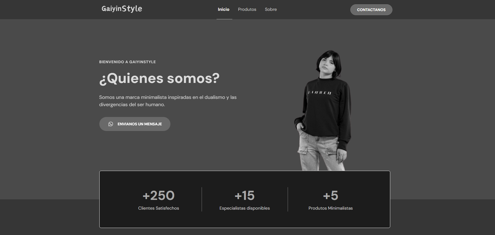

<h1 align="center"> gaiyingLinks</h1>

 Pagina de links para uma tienda de ropa virtual junto com uma landing page da pagina de produtos da marca 

  

  

# GaiyingLinks 

GaiyingLinks é um agregador de links para usar como carton de visitas online junto com uma landing page para ter a informação dos produtos 

## 🚀 Tecnologias

Esse projeto foi desenvolvido com as seguintes tecnologias:

- HTML e CSS
- JavaScript
- Git e Git hub

##🖥️ Aprendizados

- Mobile First
- Utilização da ferramenta Figma 
- Uso de git
- Criar e customizar o seu README

## Contato 💻🧑‍💻 

juniorjose1925@gmail.com

https://www.linkedin.com/in/jose-martinez-352032222/

## 🚀 Sobre mim
 Estudante de Engenharia de Software na UNOPAR e 
 Desenvolvedor Front End estudando na Rocketseat do Programa Explorer 

 ## :memo: Licença

Esse projeto está sob a licença MIT.

---

